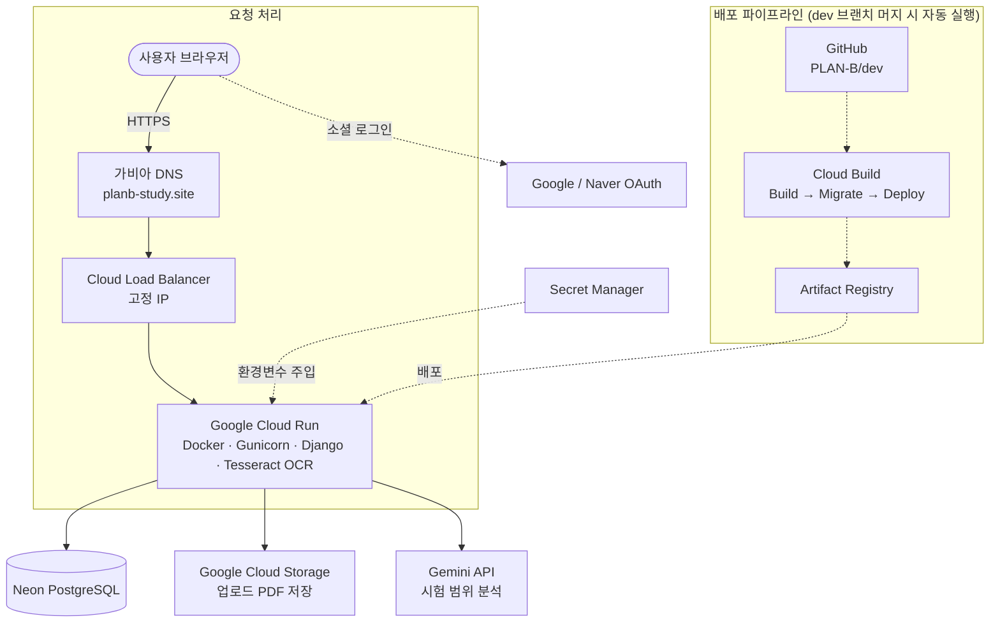

<div align="center">

# 📘 PLAN B

**실제 공부 기록에 맞춰 무너진 시험 계획을 다시 계산하는 시험 특화 학습 플래너**

계획 실패 자체보다, 실패한 다음 계획을 다시 세우는 과정을 서비스가 대신합니다.

[](https://www.python.org/)
[](https://www.djangoproject.com/)
[](https://neon.tech/)
[](https://planb-study.site)

**[🔗 서비스 바로가기 (planb-study.site)](https://planb-study.site)**

</div>

---

## 📌 서비스 소개

시험 계획을 세워도 실제로 공부하다 보면 예상보다 오래 걸리거나, 갑자기 공부할 시간이 줄면서 계획이 밀리는 일이 생깁니다. 한 번 계획이 밀리기 시작하면, 사용자는 이후 일정을 직접 다시 계산해야 합니다.

**PLAN B는 계획이 틀어졌을 때 남은 시험일까지의 시간과 남은 공부량을 다시 계산해주는 서비스입니다.** 계획 생성에서 끝나는 것이 아니라, 실행 결과가 다시 다음 계획의 입력으로 들어갑니다.

## ✨ 핵심 기능

| 단계 | 이름 | 설명 |
|:---:|:---|:---|
| 1 | **진단** | 필요한 공부시간과 실제 공부 가능한 시간을 비교해 계획을 `가능` · `위험` · `불가능`으로 판단 |
| 2 | **생성** | 업로드한 시험 범위 PDF를 AI가 분석해 작은 학습 작업으로 나누고, 날짜별 가용 시간에 배치 |
| 3 | **기록** | 완료 · 일부 완료 · 못함 여부와 실제 공부 시간을 기록, 사용자별 공부 속도(`speed_factor`)에 반영 |
| 4 | **복구** | 하루를 마감했는데 미완료 작업이 있다면, 이미 완료한 일정은 그대로 두고 남은 계획만 다시 계산 |

- AI(Gemini)는 시험 범위 PDF를 구조화된 학습 작업으로 정리하는 역할만 담당하며, **AI가 만든 작업은 사용자가 검토·수정·확정해야만** 실제 계획에 반영됩니다.
- 복구는 공부량을 최대한 유지하는 **분량 유지형**과, 중요도 낮은 작업을 제외하고 핵심을 우선하는 **핵심 집중형** 두 가지 안을 제시하고, 사용자가 비교한 뒤 직접 선택합니다.

## 🏗 시스템 아키텍처



> Cloud Run은 트래픽이 없으면 인스턴스가 0개까지 줄어드는 서버리스 방식(`min-instances=0`)으로 운영됩니다. 자동배포는 `dev` 브랜치 머지 시 Cloud Build가 **빌드 → 마이그레이션 → 배포** 순서로 진행하며, 마이그레이션이 실패하면 배포 단계 자체가 실행되지 않아 스키마 불일치를 방지합니다.

## 🛠 기술 스택

<table>
<tr><td width="140"><b>Backend</b></td><td>Django 5, Django REST 없이 서버 렌더링, django-allauth (Google · Naver OAuth)</td></tr>
<tr><td><b>Database</b></td><td>PostgreSQL (Neon, 서버리스)</td></tr>
<tr><td><b>AI</b></td><td>Google Gemini API (google-genai) — 시험 범위 PDF를 구조화된 학습 작업으로 분석</td></tr>
<tr><td><b>PDF/OCR</b></td><td>pypdfium2 (텍스트 레이어 추출), pytesseract + Pillow (스캔 PDF OCR, 신뢰도 낮은 페이지는 전처리 후 재시도)</td></tr>
<tr><td><b>Storage</b></td><td>Google Cloud Storage (django-storages) — 업로드 PDF 영구 저장</td></tr>
<tr><td><b>Infra</b></td><td>Docker, Google Cloud Run, Cloud Build, Artifact Registry, Secret Manager, Cloud Load Balancer</td></tr>
<tr><td><b>Domain</b></td><td>가비아 도메인 + Cloud Load Balancer 고정 IP 연결 (planb-study.site)</td></tr>
</table>

## 🚀 시작하기

### 개발 환경

- Python 3.12
- Django (버전 등 세부 의존성은 `requirements.txt` 참고)

### 실행 방법

```bash
git clone https://github.com/pirogramming/PLAN-B.git
cd PLAN-B
git switch dev

python -m venv venv

# Windows (Git Bash)
source venv/Scripts/activate

# macOS / Linux
source venv/bin/activate

pip install -r requirements.txt
```

`.env.example`을 복사해 `.env`를 생성합니다.

```bash
cp .env.example .env
```

```bash
python manage.py migrate
python manage.py runserver
```

> AI 분석 기능은 `.env`의 `AI_MOCK_MODE=True`(기본값) 상태에서는 실제 Gemini API 호출 없이 고정 샘플 응답으로 동작합니다. 실제 응답을 확인하려면 `GOOGLE_API_KEY`를 발급받아 `AI_MOCK_MODE=False`로 전환하세요.

## 📂 앱 구조

```
PLAN-B/
├── accounts/   # 회원가입 · 로그인 · 소셜 인증 · 사용자 공부 속도 프로필
├── exams/      # 시험 · 공부 가능시간 · 학습자료(PDF) · AI 분석 · StudyTask
├── planner/    # 날짜별 계획 생성 · 진행 기록 · 속도 보정 · 실현가능성 판정 · 복구 로직
├── core/       # 앱 전체 공통 상수(choices) · 예외 처리
├── config/     # Django 프로젝트 설정
├── templates/  # 서버 렌더링 템플릿
└── static/     # 정적 파일 (CSS/JS)
```

역할 기준으로 **시험 범위를 해석하는 영역(`exams`)**과 **실제 계획을 계산하는 영역(`planner`)**의 책임을 분리했습니다.

## 🌿 Git 브랜치 전략

- `main`: 최종 배포 브랜치
- `dev`: 개발 통합 브랜치 (머지 시 Cloud Build가 자동으로 프로덕션에 배포)
- 기능 개발은 Issue 생성 후 별도 브랜치에서 진행
- `dev` 브랜치에 직접 push 금지, PR은 반드시 `dev`를 대상으로 생성

브랜치 예시:
```
feature/#12-exam-create
fix/#18-login-error
refactor/#25-planner-service
```

## 👥 팀 구성

**Pirogramming 25기**

| 역할 | 담당자 | 담당 영역 | 정확한 담당 범위 |
|:---:|:---:|:---|:---|
| PM | 이주헌 | 계획·복구 엔진 및 백엔드 통합 | 전체 백엔드 구조 설계, planner 모델, 예상시간 계산, 실제 공부 속도 계산 및 speed_factor 보정, 실현 가능성 판정, 날짜별 일정 생성, 분량 유지형·핵심 집중형 복구 계산, 복구안 적용, 백엔드 기능 통합 |
| FE1 | 신예원 | 초기 설정·최초 계획 생성 화면 | 시험 등록, 시험일·과목 입력, 날짜별 공부 가능시간 입력, PDF·텍스트 범위 입력, AI 학습 작업 확인·수정, 최초 계획 생성 요청 화면 |
| FE2 | 강보민 | 계획 실행·복구 화면 | 실현 가능성 결과, 날짜별 계획, 오늘의 공부, 완료·일부완료·못함 입력, 복구안 비교, 복구안 선택·적용 결과 화면, 캘린더 화면 |
| BE2 | 장희원 | 계정·시험 데이터·PDF 처리 | 회원가입·로그인, accounts·exams 모델, 시험 CRUD, 날짜별 가능시간 CRUD, 학습자료 업로드·저장, PDF 유효성 검사, PDF 텍스트 추출, StudyUnit·StudyTask CRUD, 사용자 수정값 저장 |
| BE3 | 김유겸 | AI 분석·진행 기록·캘린더·배포 | 추출된 텍스트를 AI에 전달, 단원·학습 작업 생성, 작업 유형·중요도·깊이·난이도 추천, AI 응답 JSON 검증·예외처리, 공부 진행 결과 저장, 캘린더, GCP 배포 및 인프라 구성 |

---

<div align="center">

Made with 🔥 by **Team PLAN B** · Pirogramming 25기

</div>
